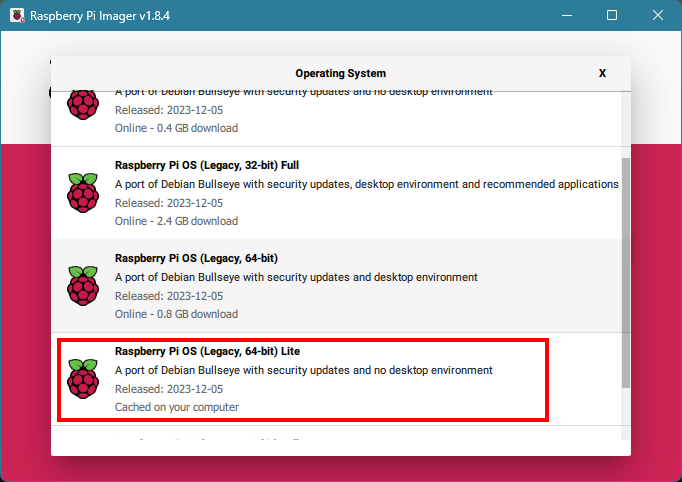

# The Simpsons TV project

This repository supports my modifications to [The Simpsons TV](https://withrow.io/simpsons-tv-build-guide) project originally created by Brandon Withrow and enhanced by D.J. Hatfield in his [larger 3.5" screen version](https://www.instructables.com/The-Simpsons-TV-35-Screen-Version/).

## What's different in this version?

I've primarily followed the [D.J. Hatfield's Instructables guide](https://www.instructables.com/The-Simpsons-TV-35-Screen-Version/) however his build is based on the "Buster" version of Raspberry Pi OS which is more difficult (not impossible though!) to find these days and impacts some of the software used in the build. For example, the video player, OMXPlayer, is not available in Bullseye. This is the script I've started using in my build.

This repository includes:

- [player.py](./player.py): a modified version of D.J. Hatfield's Python script to control playback and selection of video files using VLC instead of OMXPlayer.
- [player-alt.py](./player-alt.py): an alternate version of the player script that uses a more efficient approach to respond to GPIO signals. The result is less code and a simpler programming model, at least to me.

> [!WARNING]
>
> - There are some differences in behaviour in my versions of the scripts and D.J. Hatfield's version. This is a result of changes in using VLC and some choices I made for my build. Read on for more details.
> - I am **not** a Python programmer! I've made changes based on my knowledge of other programming languages, some quick reading of documentation, trial and error. The scripts work for me, but your mileage may vary.

### How `player.py` differs from the original

1. VLC is used for playback instead of OMXPlayer.
2. The script will play back files with the extension `.mkv` as I encoded my videos using a Matroska container format. If you're using `mp4` files, replace `mkv` with `mp4` on line 106 of the script.

### How `player-alt.py` differs from the original

1. VLC is used for playback instead of OMXPlayer.
2. The script will scan all directories in `/home/pi/simpsonstv/videos/` and pick video files. It isn't necessary to list all the "channel" directories you want to use.
3. The script will play back files with the extension `.mkv`.
4. I've used GPIO event handlers to GPIO signals (e.g. button presses) instead of a tight loop. This uses less CPU time and, to me, is a neater approach. This has some other consequences:
   - I have not implemented the VCR two-button shutdown behaviour of the original script.
   - I have implemented but not tested the safe shutdown signal handler (GPIO 11). I didn't implement this circuit in my build. It might work! 😉
5. I've used a VLC media list to make it easier to navigate between videos (either automatically after finishing a video, or manually by using the right VCR button). There is a significant downside to this choice:
   - I couldn't find a way to display the current channel or video name upon playback or changing to the next video or channel. I tried using `--sub-filter=marq` when initialising VLC and then adding a function to set the marquee message but it didn't work for me, I would get an error `lbvlc no matching alpha blending routing (chroma: YUVA DPV0)`. If anyone knows of a fix or an alternative, I'd love to hear about it - feel free to submit a pull request!

## A note about `usbmount`

The `usbmount` package has been removed from Raspberry Pi OS "Bullseye". This package was used in D.J. Hatfield's build instructions to allow a USB device to be plugged into the Raspberry Pi to transfer video files. I'm not using this process to copy files to the Raspberry Pi as I simply transferred them over my local network.

## How to use Raspberry Pi OS "Bullseye" for the The Simpsons TV

If you're following [D.J. Hatfield's excellent Instructable](https://www.instructables.com/The-Simpsons-TV-35-Screen-Version/), you can make the following changes to his instructions to install Raspberry Pi OS "Bullseye" instead of "Buster" and use VLC instead of OMXPlayer.

The step numbers refer to [D.J. Hatfield's Instructable](https://www.instructables.com/The-Simpsons-TV-35-Screen-Version/)

### Step 16: Set Up the Raspberry Pi: Installing the OS on the Micro SD Card

When selecting the Operating System using the Raspberry Pi Imager, select **Raspberry Pi OS (Legacy, 64-bit) Lite**, the "Bullseye" version.



#### Install OMXPlayer

Instead of installing OMXPlayer, we'll be installing VLC. Instead of following the steps in D.J. Hatfield's guide for this step, run the following commands:

```bash
sudo apt-get install vlc
sudo apt-get install python3-pip
sudo pip install python-vlc
```

Then continue following the instructions in the **Set Up Directory Structure** section.

#### Set Up Directory Structure

Follow the original instructions including creating the `player.py` file:

```bash
sudo nano ~/simpsonstv/player.py
```

Instead of copying and pasting the script in the Instructable, open either [player.py](./player.py) or [player-alt.py](./player-alt.py) depending on what functionality you're looking for and copy/paste the contents of one of these files into the nano text editor (paste in the nano editor by copying the text below, then selecting your terminal window, then right-clicking your mouse.)

If you're using [player.py](./player.py) be sure to follow the original instructions to configure your "channels" by defining the contents of the `Directories` array.

If you're using [player-alt.py](./player-alt.py) you do not need to define the `Directories` array but you should continue with the remaining instructions to save your changes and close the nano editor.

All other instructions are the same.
